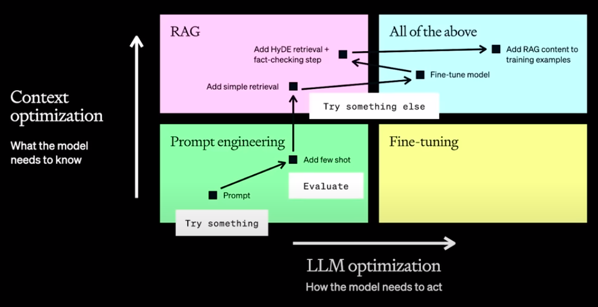

## [A Survey of Techniques for Maximizing LLM Performance](https://youtu.be/ahnGLM-RC1Y)
Release date : 04/04/24
### Idea
- Optimizing LLMS to get into prod properly
- depends on the sue case, no one shoe
- understand problem and its performance metric

### Details
- First start with prompt engineering (not scaleable, best for evaulating)
    - to understand if its a context problem or (rag)
    - how the llm should behave, and follow instruction (peft)
- Then do few shot (to see if the performance increases)
- If it is working then rag (short term memory)
- If none works then fine tuning (long term embedded memory)
- 
- If this decreases retrival capability then optimize the RAG using techniques like
    - retrival with cosine similrity #DOUBT
    - HyDE retrival : fake answer similariy search
    - FT embedding : fine tuning embedding, expensive
    - embedding/chunk experiments 
    - fact checking step
    - Reranking : rules based
    - adding meta data for clasification
    - Query expansion : splitting query, processing in ||l and combing the results
    - access to tool
    - Self-consistency
    - Auto-evaluation
    - Chain of thought reasoning
#### Prompt engineering
- Write clear instructions
- Split complex tasks into simpler subtasks
- Give GPTs time to "think" (ReAct framework)
- Test changes systematically
- Provide reference text
- Use external tools
- Used for 
    - Testing and learning early
    - When paired with evaluation it provides your baseline and sets up further optimization
- Not useful
    - Introducing new information
    - Reliably replicating a complex style or method, i.e. learning a new programming language
    - Minimizing token usage
    - hence not scaleable
- Few shot
    - show than tell
    - must lead to improvement

#### RAG
- If few shot was succesful, mahe it scaleable using bigger custom doc
- Domain specific information is added
    - embedded to store in a knowldge base
    - which is used for similarity search for the query asked
    - prompt + content from vector base is given to llm to generate answer
- Used for
    - Introducing new information to the model to update its knowledge
    - Reducing hallucinations by controlling content
- Not for 
    - Embedding understanding of a broad domain
    - Teaching the model to learn a newlanguage, format or style
    - Reducing token usage
    - only custom data learning can backfire in some cases
        - llm can make mistake
        - search can be incorrect
#### Evaluating frameworks
- Exploding gradients's [RAGAS](https://docs.ragas.io/en/stable/getstarted/evaluation.html)
    - How well the LLM answered the question?
        - faithfull ness : facts checking, to avoid halucination
        - answer relvancy
    - How relevant the content retrieved 1s to tne question?
        - context precision : to prevent loss in middle, and signal to noise ratio of retived context
        - context recall : Can it retrieve all the relevant information required to answer the question

#### Fine tuning
- Continuing the training process on a smaller, domain-specific dataset to optimize a model for a specific task
- from general to specialization
- benefits
    - Often a more effective way of improving model performance than prompt- engineering or Few Shot
    - Reduce the number of tokens needed to get a model to perform well on your task, cheaper, faster
    - Distill the expertise of a large model into a smaller one
- When to use
    - Emphasizing knowledge that already exists in the model
    - Customizing the structure or tone of responses
    - Teaching a model very complex instructions
- When not to
    - Adding new knowledge to the base model (go for RAG)
    - Quickly iterating on a new use-case (its a time consuming task)
- The quality of the data is important
- Steps
    1. data preparation : collection, validation, qulaity check
    2. Trainig : selct hyperparameters (fitting, forgetting), understanding loss function (proxy for next token production)
    3. Evaluation : experts, comparing models outputs, powerful model ranks new one
    4. inference : get feedback, update the mdoel as per results
- Best practices
    - start with prompt and Few shot
    - establish baseline
    - Datasets can be difficult to build, start small and invest intentionally. Optimize for fewer high-quality training examples.
- FT + RAG : to reduce context size
### Resource
- [RAGAS](https://github.com/explodinggradients/ragas)

### misc
 
---
