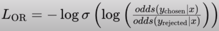

## [Combined Preference and Supervised Fine Tuning with ORPO](https://youtu.be/OWMJ0rBUj04)
Release date : 28/03/24
### Idea
- preference FT and supervised FT at the same time
- gives better result with just SFT

### Details
- ORPO combines crss entropy loss with consideration of relative probabilty of chosen responses and rejected responses
- PPO usually in training LLM
    - unsupervised -> supervised -> RLHF (with reward model input) -> ref and policy model training -> model
- DPO, removed the reward model part, and used prefered and rejected responses to align the model
    - unsupervised -> supervised -> DIRECT Preference Optimisation -> model
    - gave raise to KTO IPO etc,
    - but this wasn relianebl and there was still labelling of rejected and accepted response task
- ORPO
    - unsupervised -> supervised (with preference) -> model
    - removed reward and DPO also

#### Mechanism
- Preference = odds ratio
- supervised tuning has both cross entroy loss and ratio of prob of chosen and rejected response
1. normal unsupervised
    - usually one column of data - *text*
    - rows are often chunks of a larger database of text
    - trains the model on the statistical patterns of language
        - hide part of sentence and predict the next token to lower the loss function
2. SFT (for chat or qna)
    - usually two columns of data - *user* and *assistant*
    - rows are generated by humans (or other language models, synthetic data)
    - gets the model used 10 a conversation
3. PEFT (Preference FT)
    - usually three columns of data - *prompt™, *chosen*, *rejected*
    - rows are "pairs" that are rated as better/chosen or worse/rejected
    - shifts the statistical representation towards "good" answers
    - to shift the stat representation of the model towards good and away from the bad
- Model optimization in unsuper and super
    - Involves cross entropy loss to guide the model towards a desireable stat rep
- Model optimization in ORPO
    - Loss here has two components
    - one is the susual cross entropy loss by SFT
    - And another is a lambda.Lor
    - where Lambda is a weight factor that balances both the components of the total loss
    - and Lor is 
    
    - penalise the model rejected is preferred over chosen!

```python
# stable versions for this script (DO NOT INSTALL FOR UNSLOTH, see be !python -m pip install -—-upgrade pip -q
# !pip install transformers==4.38.1 -q -U # !pip install trl==0.7.11 -q -U
!pip install -q -U bitsandbytes==0.43.0 -q
!pip install -q -U peft==0.10.0 -q
!pip install -q -U accelerate==0.28.0 -q
!pip install -q datasets==2.18.0 -q
!pip install -q -U scipy==1.12.0 -q
!pip install -U flash-attn==2.5.6 -q
!pip install hf_transfer==0.1.6 -q
!pip install huggingface_hub==0.22.0 -q
!pip install wandb==0.16.5 -q


# # latest versions (may break the script due to updates)
# !python -m pip install —upgrade pip -q
!pip install git+https://github.com/huggingface/transformers.git -q #r 
!pip install git+https://github.com/huggingface/trl.git -q #required f !pip install -q -U bitsandbytes -d
# !pip install -q -U peft -q
# !pip install -q -U accelerate -q
# !pip install -q datasets -q
# !pip install -q -U scipy
# !pip install -U afr
# !pip install hf_transfer -q
# !pip install huggingface_hub -q
# !pip install wandb -q


model_id = "mistralai/Mistral-7B-v0.1" #v0.2 is avaialable


from transformers import AutoTokenizer, AutoModelForCausalLM, BitsAndBytesConfig
import torch
bnb_config = BitsAndBytesConfig( load_in_4bit=True, bnb_4bit_use_double_quant=True, bnb_4bit_quant_type="nf4", bnb_4bit_compute_dtype=torch.bfloat16 )

# config = AutoConfig.from_pretrained(model_id) # config.max_position_embeddings = 4096 # (input + output) tokens can nrs

model = AutoModelForCausalLM. from_pretrained( model_id,
# config=config, # quantization_config=bnb_config,
# rope_scaling={"type": "linear", "factor": 2.0},
device_map='auto',
# trust_remote_code=False,
torch_dtype=torch.bfloati6,
attn_inplenentation="flash_attention 2", # works with llama
cache_dir=cache_dir)

tokenizer = AutoTokenizer.from_pretrained(model_id,use_fast=True, trust_remote_coi...
)

# LORA iN SFT
def print_trainable_parameters (model):
    # Prints the number of trainable paramete#rs in the model and lists which param
    trainable_params = 0
    non_trainable params = 0
    all_params= 0

    print("Trainable 'Parameters:" )
    for name, param in model.named_parameters():
        all_params += param.numel()
        if param. requires_grad:
            trainable_params += param.numel()
            print(f" {name}")
        else:
            non_trainable_params += param.numel()
    print("\nNon-Trainable Parameters:") 
        or name, param in model.named_parameters():
            if not param. requires_grad:
                print(f" {name}")
    print(f"\nSummary:\n Trainable params: {trainable_params}\n Non-Trainable param : {non_trainable_params} ")


# LORA or DORA
from peft import prepare_model_for_kbit_training
model.gradient_checkpointing_enable() #Comment this in to save on VRAM
# model = prepare_model_for_kbit_training(model) # only set this if using quant:
from peft import LoraConfig, get_peft_model

peft_config = LoraConfig( #matching the Llama recipe
    r=8,
    lora_alpha=32,
    target_modules=[
        "q_proj",
        "k- proj",
        "v_proj",
        "o_proj",
        # "self_attn.rotary_emb.inv_freq", "gate_proj",
        "up_proj",
        "down_proj",
        "llm_head", # Language model head - best to set this trainable if chat fil 
        # "lora_magnitude_vector", #required for DoRA
        # ""input_layernorm.weight", #can't be lora fine-tuned as it's not a Lineé
        # "post_attention_layernorm.weight", #can't be lora fine-tuned as it's m 
        # "model.norm.weight", #can't be lora fine-tuned as it's not a linear 
        # "dense_h_to_4h", #for falcon 
        # "dense_4h_to_h", #for falcon 
        # "query_key_value", #for falcon 
        # "dense" #for falcon
        ],
    lora_dropout=0.1,
    bias="none",
    task_type="CAUSAL_LM",
    # use_dora=True # only for DoRA
)
model = get_peft_model(model, peft_config) #move to a peft model

# # OPTIONALLY SET THE CHAT TEMPLATE MANUALLY
# Llama/Mistral template. NOTE: This is a special chat template that makes sure
tokenizer.chat_template = "{{ bos_tok¢
#Test the chat template
messages=([ { 'role': 'user', 'content': "write a quick sort algorithm in python."},
{ 'role': 'assistant', 'content': "here you are."}, { 'role': 'user', 'content': "great."},])

inputs = tokenizer.apply_chat_template(messages, tokenize=False)
print(inputs)|

## OPTION A — set the pad token to <pad>, if not <|pad|>, if not <unk> if <unk> :
if '<pad>' in tokenizer.get_vocab():
    print('<pad> token is in the tokenizer. Using <pad> for pad')
# Set the pad token
tokenizer.pad_token = '<pad>'
elif '<|pad|>' in tokenizer.get_vocab():
    print('<|pad|> token is in the tokenizer. Using <|pad|> for pad')
# Set the pad token
tokenizer.pad_token = '<|pad|>'
elif '<unk>' in tokenizer.get_vocab():
    print('<unk>sgoken is in the tokenizer. Using unk for pad')
# Set the pa ote
tokenizer.pad_token = '<unk>'
else:
    print(f'Using EOS token, {tokenizer.eos_token}, for padding. WARNING, this m')
tokenizer.pad_token = tokenizer.eos_token


# Update pad token id in model and its config
model.pad_token_id = tokenizer.pad_token_id
model.config.pad_token_id = tokenizer. pad_token_id
# Check if they are equal assert
model.pad_token_id == tokenizer.pad_token_id, "The model's pad ©
# Print the pad token ids
print('Tokenizer pad token ID:', tokenizer.pad_token_id)
print('Model pad token ID:', model.pad_token_id)
print('Model config pad token ID:', model.config.pad_token_id)
print('Number of tokens now in tokenizer:', tokenizer.vocab_size)

# Set embed and norm layers to trainable (recommendéd for chat fine-tuning if you are changing thé template) 4

# List to hold the names of the trainable parameters
# trainable_params_names = ["word_embeddings",""input_layernorm", "ln_f"] #for Fa
trainable_params_names = ["embed_tokens", "input_layernorm", "post_attention_lay"]
 # trainable_params_names = ["embed", "norm"] #for DeepSeek Coder
# Set modules to be trainable
for n, p in model.named_parameters():
    if any(k in n for k in trainable_params_names) :
        p. requires_grad_(True) 
    # else: 
    #      p.requires_grad_(False) # Optional: Set the rest to be not trainable
# Make a dictionary of trainable,parameters
trainable_params = {n: p for np in model.named_parameters() if p.requires_grad}
# Convert trainable_params to state_dict format
trainable_params_state_dict = {n: p.data for n, p in trainable_params. items()}

# EVALUATION
# SKIPPING

```

### Resource
- [HF](https://huggingface.co/docs/trl/main/en/orpo_trainer)
- [paper](https://arxiv.org/pdf/2403.07691.pdf)
- [example model](https://huggingface.co/kaist-ai/mistral-orpo-beta)
- [blog](https://medium.com/@zaiinn440/orpo-outperforms-sft-dpo-train-phi-2-with-orpo-3ee6bf18dbf2)
- 

### misc
 
---
