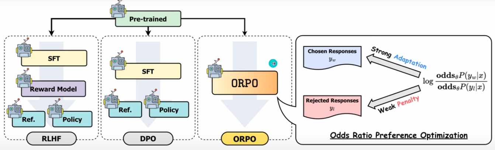
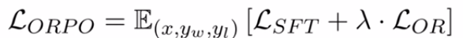
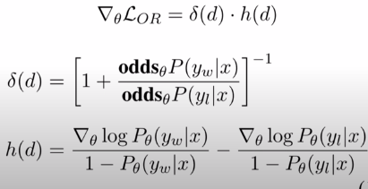

## [ORPO: NEW DPO Alignment and SFT Method for LLM](https://youtu.be/6kkJGkPZP88)
Release date : 24/03/24
### Idea
- OPenAI invented PPO : Proximal Policy Optimization reinforcement learning algorithm that improves the stability and efficiency of policy updates by limiting the size of policy changes at each step
- Then came DPO : Direct Policy Optimization refers to directly optimizing a policy in reinforcement learning by adjusting the policy parameters to maximize expected rewards without intermediary models
    - with IPO, KTO, etc
- Now its ORPO
    - Odds Ratio Preference Optimization (ORPO) algorithm offers a profound leap forward in the methodology of supervised fine- tuning (SFT) and preference alignment within language models

### Details
- by 'Korea Advanced Institute of Science and Technology ("KAIST Al")
- In PPO (RLHF), after pretrainig, there was a reward mode and a SFT model then combined as reference and policy
- DPO removed reward
- ORPO
    - aligns the language model without a reference model in a single-step manner by assigning a weak penalty to the rejected responses and a strong adaptation signal to the chosen responses with a simple log odds ratio term appended to the negative log-likelihood loss.
- 
- This is preferenced aligned SFT

```python
# Mistral 7B "ORPO preference-aligned SFT" on dataset: HuggingFaceH4/ultrafeedback_binarized

from transformers import AutoModelForCausalLM, AutoTokenizer
model = AutoModelForCausalLM. from_pretrained("kaist-ai/mistral-orpo-alpha")
tokenizer = AutoTokenizer.from_pretrained("kaist-ai/mistral-orpo-alpha")

# Apply chat tempLate
query = [{'role': 'user', 'content': 'Hi! How are you doing?'}]
prompt = tokenizer.apply_chat_template(query, tokenize=False, add_generation_prompt=True)
inputs = tokenizer(prompt, return_tensors='pt')

# Generation with specific configurations
output = model. generate( **inputs, max_new_tokens=128, do_sample=True,  temperature=0.7)
response = tokenizer.batch_decode(output)

```
- Cross entropy loss just by itself doesn penalize whats undesired
- This method stops rejected from entering SFT phase
- There by getting rid of alignemnt phase of DPO
- i.e. within SF enfore whats desired bby eleminating the rejected
- there is a connection between artificial intelligence (Al) loss functions and the Lagrangian framework in physics.

- The penalty for unwanted generation styles in the Odds Ratio Preference Optimization (ORPO) method shares conceptual similarities with regularization terms in machine learning.
- Both serve to guide the optimization process towards more desirable solutions by incorporating additional criteria or constraints into the loss function.
- objective function is
    - Lsft follows the conventional causal language modeling negative log-likelihood (NLL) loss function to maximize the likelihood of generating the reference tokens. Lor, maximizes the odds ratio between the likelihood of generating the dis-favored response yw and the disfavored response yl
- 
- The ORPO loss function integrates this penalty directly into its objective, alongside the conventional supervised fine-tuning (SFT) loss. The total loss is thus a combination of the original loss (e.g., for prediction accuracy) and an additional term that penalizes certain types of generation, thereby steering the model away from them.
- 
- 
### Resource
- [paper](https://arxiv.org/pdf/2403.07691v2.pdf)
- [github](https://github.com/xfactlab/orpo)

### misc
- Too much noise in between comaring this with physics and reglarization
---
