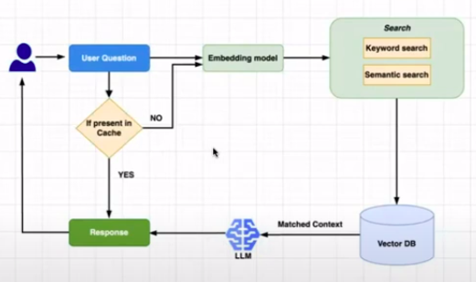

## [RAG Production Trick - Semantic Cache (Step-by-step Juicy Code Walk-Through)](https://youtu.be/z4MKqZtV7T4)
Release date : 04/04/24
### Idea
- cache is super fast memory to access, if data is freqnetly being used
- If a question is being asked frequently in a RAG setup, it can be cached so that the response is faster
- The question and response can be saved in a KV pair db

### Details
- 
- since cache is small, not many q&A can be stored
- If the wording of the question is a bit different then this simple system might not work
- This is where semantic cache comes in
    - Where when a question comes in, and the cache is searched, it will be a sematic search not the simple exact match search
    - cosine similarity, eucaliden distance etc
- benefits
    - for a q&a on an internal doc
    - most will be repeated and similar
    - this will reduce the use of llms and use cache instead
    - will save cost of using and reources behind the llms
- In production caveats
    - Cant use in case of code/blog generation like process
    - Once in cache the answer will be constant and same without any randomness or creativity to it irrespective of the temprature
- Code explanation
    - cache : faiss
    - vectorDB : chroma

### Resource
- [code](https://colab.research.google.com/github/huggingface/cookbook/blob/main/notebooks/en/semantic_cache_chroma_vector_database.ipynb)
- [blog](https://huggingface.co/learn/cookbook/semantic_cache_chroma_vector_database)

### misc
 
---
